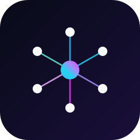
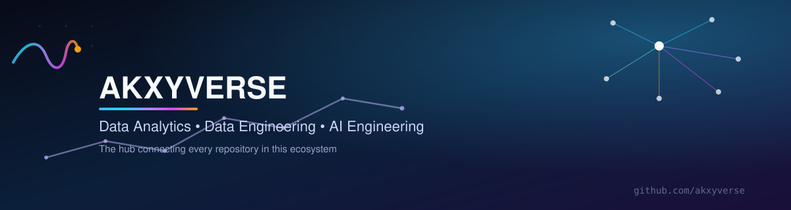

  

 

&nbsp;

 

<table>
<tr>
<td width="25%" align="center" valign="top">

**🧭 Who**

Akash Yadav — Aspiring Data Analyst from India, learning and building in public.

</td>
<td width="25%" align="center" valign="top">

**💡 Why This Page**

The single starting point for everything I build — one hub, eight focused repositories.

</td>
<td width="25%" align="center" valign="top">

**👥 For**

Recruiters, hiring managers, fellow learners, and anyone exploring Data Analytics.

</td>
<td width="25%" align="center" valign="top">

**🎁 Value**

A live, growing map of real skills — not a static resume.

</td>
</tr>
</table>

### 🧭 Explore the Ecosystem

<table>
<tr>
<td align="center" width="11%"><a href="https://github.com/akxyverse/data-analytics-knowledge-system"><b>🧠</b> Knowledge Hub</a></td>
<td align="center" width="11%"><a href="https://github.com/akxyverse/data-analytics-projects"><b>🚀</b> Projects</a></td>
<td align="center" width="11%"><a href="https://github.com/akxyverse/datasets"><b>📦</b> Datasets</a></td>
<td align="center" width="11%"><a href="https://github.com/akxyverse/data-analytics-resources"><b>📚</b> Resources</a></td>
<td align="center" width="11%"><a href="https://github.com/akxyverse/career-hub"><b>💼</b> Career</a></td>
<td align="center" width="11%"><a href="https://github.com/akxyverse/content-studio"><b>✍️</b> Content</a></td>
<td align="center" width="11%"><a href="https://github.com/akxyverse/certifications"><b>🏅</b> Certs</a></td>
<td align="center" width="11%"><a href="https://github.com/akxyverse/ai-automation"><b>🤖</b> AI Automation</a></td>
</tr>
</table>

---

## 👨‍💻 About Me

👋 Hi! I'm **Akash Yadav**, an Aspirant **Data Analyst** from **India 🇮🇳**

- 🎯 **Role** — Aspirant Data Analyst passionate about turning raw data into decisions
- 📍 **Location** — India 🇮🇳
- 🔭 **Focus** — Data Cleaning · EDA · Visualization · Dashboards
- 🛠️ **Core Tools** — Python · SQL · Power BI · Tableau
- 📚 **Currently Learning** — Machine Learning · Advanced SQL · DAX
- 📊 **What I do** — Clean & transform complex datasets, build interactive dashboards, and deliver data-driven insights
- 🤖 **Extra Edge** — I leverage AI tools to automate and optimize analytical workflows
- ⚡ **Fun Fact** — I believe every dataset has a story — I just find it 🔍

## 🛠️ Tech Stack & Tools

<table align="center">
  <tr>
    <td align="center" width="50%">

**💻 Languages & Core**

</td>
    <td align="center" width="50%">

**🗄️ Databases**

</td>
  </tr>
  <tr>
    <td align="center">

**📦 Python Libraries**

</td>
    <td align="center">

**📊 BI & Visualization**

</td>
  </tr>
  <tr>
    <td align="center">

**🤖 AI Tools**

</td>
    <td align="center">

**🔄 Automation & Version Control**

</td>
  </tr>
  <tr>
    <td colspan="2" align="center">

**🧰 Dev Environments**

</td>
  </tr>
</table>

## 🗂️ Repository Ecosystem

My Data Analytics work is organized across 8 focused repositories (plus this profile hub) rather than one giant monorepo — each has a single, clear purpose, and every one shares the same design language:

<table>
<tr>
<td width="50%" valign="top">

**🧠 [Data Analytics Knowledge Hub](https://github.com/akxyverse/data-analytics-knowledge-system)**
Core DA learning — fundamentals, Python, SQL, BI tools

**🚀 [Data Analytics Projects](https://github.com/akxyverse/data-analytics-projects)**
Hands-on projects — tool-wise, domain-wise, end-to-end

**📦 [Datasets](https://github.com/akxyverse/datasets)**
Datasets shared across projects, organized by source

**📚 [Learning Resources](https://github.com/akxyverse/data-analytics-resources)**
Books, docs, papers, courses, cheat sheets

</td>
<td width="50%" valign="top">

**💼 [Career Hub](https://github.com/akxyverse/career-hub)**
Resume, interview prep, applications, career planning

**✍️ [Content Studio](https://github.com/akxyverse/content-studio)**
LinkedIn posts, articles, tutorials, content assets

**🏅 [Certifications](https://github.com/akxyverse/certifications)**
Certifications in progress, completed, and earned

**🤖 [AI Automation](https://github.com/akxyverse/ai-automation)**
Generative & Agentic AI, LangChain, n8n, automation

</td>
</tr>
</table>

## 🌟 Featured Projects

Fully hosted inside [`data-analytics-projects`](https://github.com/akxyverse/data-analytics-projects) and [`data-analytics-resources`](https://github.com/akxyverse/data-analytics-resources) — each with its own live demo and full documentation:

<table>
<tr>
<td width="50%" valign="top">

**📊 [Excel Roadmap Guide](https://github.com/akxyverse/data-analytics-resources/tree/main/Guidebooks/Excel%20Roadmap%20Guide)**
A step-by-step Excel roadmap from basics to advanced — 30 skills across 4 levels, built for aspiring data analysts.
`Excel` `Data Analysis` `Free Resource`

</td>
<td width="50%" valign="top">

**⚡ [ThunderCast: Storm Forecasting Platform](https://github.com/akxyverse/data-analytics-projects/tree/main/End-to-End%20Projects/ThunderCast)**
Real-time thunderstorm prediction using Facebook Prophet time-series forecasting, live weather API integration, and an interactive Streamlit dashboard.
`Python` `Prophet` `Streamlit` [🔗 Live Demo](https://akxyverse-thundercast-smart-storm-predictio-dashboardapp-xqeckf.streamlit.app/)

</td>
</tr>
<tr>
<td width="50%" valign="top">

**🎮 [Esports & Gaming Revenue Analytics](https://github.com/akxyverse/data-analytics-projects/tree/main/Domain-wise%20Projects/Others/Esports%20Gaming%20Revenue%20Analytics)**
Analyzed 400+ records across 25 countries (2010–2025) — 17.7% CAGR in gaming revenue, Europe/Asia market dominance, interactive Tableau dashboard.
`Python` `Tableau` `EDA`

</td>
<td width="50%" valign="top">

**📦 [Supply Chain Analytics Dashboard](https://github.com/akxyverse/data-analytics-projects/tree/main/Domain-wise%20Projects/Logistics/Supply%20Chain%20Analytics%20Dashboard)**
Analyzed 43K+ delivery records with 30+ visualizations — KPI metrics and insights on delivery performance and agent efficiency.
`Python` `Streamlit` [🔗 Live Demo](https://supply-chain-analytics-system-5tlaustxwavffqjplsgutw.streamlit.app/)

</td>
</tr>
</table>

Not shown here: a private algorithmic trading repository (kept private by design) and a forked reference notes repository (not original work — see <a href="https://github.com/akxyverse/data-analytics-resources/tree/main/External%20Study%20Resources">External Study Resources</a>).

## 📈 GitHub Stats

## 📊 Contribution Graph

---

**⭐ If any of this ecosystem is useful to you, a star goes a long way.**

Akash Yadav — learning in public, one repository at a time.

