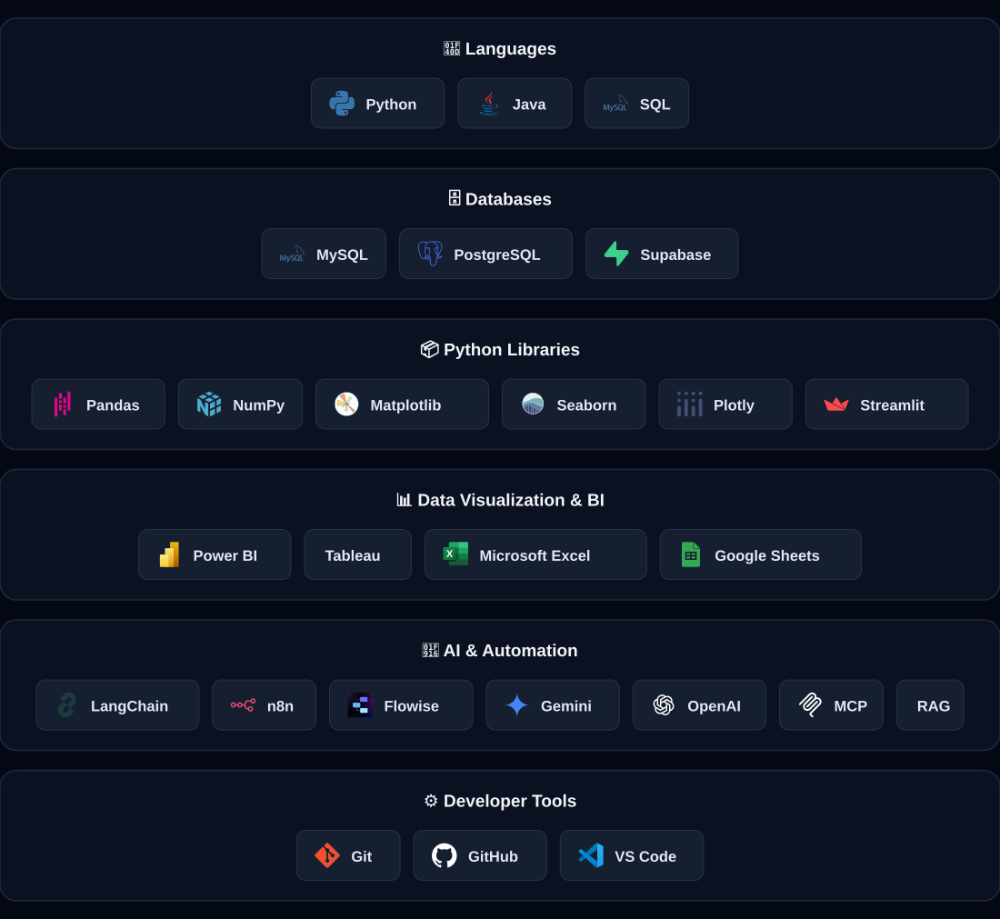

 

# 

**Turning raw data into meaningful insights through analytics, dashboards, automation, and AI-powered workflows.**

 

**📊 Quick Stats**
 

&nbsp;•&nbsp;

&nbsp;•&nbsp;

  

**🚀 Quick Navigation**
 

&nbsp;

&nbsp;

 

&nbsp;

&nbsp;

 

⬇ Discover the Akxyverse Ecosystem ⬇

  

## 👨‍💻 About Me

### 👋 Meet the Creator

➤ **Hi, I'm Akash Yadav.**

I turn messy, real-world data into insights people can actually act on — through dashboards, automation, and AI-assisted workflows. Most of what I build lives here, in the open, as I learn.

➤ **Based In:** India 🇮🇳

➤ **Role:** Aspiring Data Analyst

➤ **Focus:** Data Analytics, Business Intelligence, Python, SQL & AI Automation

➤ **Currently Building:** Akxyverse

➤ **Goal:** Build practical analytics solutions that help people make better decisions.

 

### 🚀 Explore My Work

➤ **Projects**
Hands-on analytics solutions solving real business problems.

➤ **Dashboards**
Interactive Power BI and Tableau reports.

➤ **Guidebooks**
Curated roadmaps, notes and learning resources.

➤ **AI Workflows**
Automation using modern AI tools.

➤ **Datasets**
Real and practice datasets used throughout projects.

➤ **Career Resources**
Resume, interview preparation and job search materials.

### 🎯 Mission

> **Build projects that solve real problems.**

Not tutorials that get abandoned halfway — end-to-end work that actually ships, gets documented honestly, and hopefully helps someone else learn a little faster too.

### 🧠 Currently Learning

---

## 🗺 Choose Your Path

*First time here? Pick what you're looking for.*

<table>
<tr>
<td width="25%" align="center" valign="top">

### 🎓 Student
*Learning data analytics from scratch*

[Knowledge Hub](https://github.com/akxyverse/data-analytics-knowledge-system) ➤ [Learning Resources](https://github.com/akxyverse/data-analytics-resources) ➤ [Projects](https://github.com/akxyverse/data-analytics-projects)

</td>
<td width="25%" align="center" valign="top">

### 💼 Recruiter
*Evaluating my work*

[Featured Project Universe](#-featured-project-universe) ➤ [Certifications](https://github.com/akxyverse/certifications) ➤ [Career Hub](https://github.com/akxyverse/career-hub)

</td>
<td width="25%" align="center" valign="top">

### 📊 Fellow Analyst
*Looking for projects, tools, techniques*

[Projects](https://github.com/akxyverse/data-analytics-projects) ➤ [Datasets](https://github.com/akxyverse/datasets) ➤ [Knowledge Hub](https://github.com/akxyverse/data-analytics-knowledge-system)

</td>
<td width="25%" align="center" valign="top">

### 🤖 AI Enthusiast
*Interested in automation*

[AI Automation](https://github.com/akxyverse/ai-automation) ➤ [Projects](https://github.com/akxyverse/data-analytics-projects)

</td>
</tr>
</table>

---

## ⚔️ Tech Arsenal

  

## 🚀 Featured Project Universe

Real, working analytics products, not a static list — new ones ship regularly, so this points straight to the live source instead of going stale.

**🚀 [Browse All Projects ➤](https://github.com/akxyverse/data-analytics-projects)**

## 🧭 Repository Explorer

➜ **Welcome to the Akxyverse Ecosystem.**

Everything I build, learn, and share is organized into dedicated repositories. Expand any repository below to explore its complete folder hierarchy and discover what's inside.

<b>🧠 Knowledge Hub</b> — <a href="https://github.com/akxyverse/data-analytics-knowledge-system">data-analytics-knowledge-system</a>

<pre>
<a href="https://github.com/akxyverse/data-analytics-knowledge-system">data-analytics-knowledge-system</a>
│
├-------------▶  <b><a href="https://github.com/akxyverse/data-analytics-knowledge-system/tree/main/Fundamentals%20of%20Data%20Analytics">Fundamentals of Data Analytics</a></b>
│                │
│                ├-------------▶  <a href="https://github.com/akxyverse/data-analytics-knowledge-system/tree/main/Fundamentals%20of%20Data%20Analytics/Mathematics">Mathematics</a>
│                │                │
│                │                ├- - - - -▶  <a href="https://github.com/akxyverse/data-analytics-knowledge-system/tree/main/Fundamentals%20of%20Data%20Analytics/Mathematics/Calculus">Calculus</a>
│                │                │
│                │                ├- - - - -▶  <a href="https://github.com/akxyverse/data-analytics-knowledge-system/tree/main/Fundamentals%20of%20Data%20Analytics/Mathematics/Discrete%20Mathematics">Discrete Mathematics</a>
│                │                │
│                │                └- - - - -▶  <a href="https://github.com/akxyverse/data-analytics-knowledge-system/tree/main/Fundamentals%20of%20Data%20Analytics/Mathematics/Linear%20Algebra">Linear Algebra</a>
│                │
│                ├-------------▶  <a href="https://github.com/akxyverse/data-analytics-knowledge-system/tree/main/Fundamentals%20of%20Data%20Analytics/Probability">Probability</a>
│                │
│                └-------------▶  <a href="https://github.com/akxyverse/data-analytics-knowledge-system/tree/main/Fundamentals%20of%20Data%20Analytics/Statistics">Statistics</a>
│                                 │
│                                 ├- - - - -▶  <a href="https://github.com/akxyverse/data-analytics-knowledge-system/tree/main/Fundamentals%20of%20Data%20Analytics/Statistics/Descriptive%20Statistics">Descriptive Statistics</a>
│                                 │
│                                 └- - - - -▶  <a href="https://github.com/akxyverse/data-analytics-knowledge-system/tree/main/Fundamentals%20of%20Data%20Analytics/Statistics/Inferential%20Statistics">Inferential Statistics</a>
│
└-------------▶  <b><a href="https://github.com/akxyverse/data-analytics-knowledge-system/tree/main/Data%20Analytics%20Technologies">Data Analytics Technologies</a></b>
                 │
                 ├-------------▶  <a href="https://github.com/akxyverse/data-analytics-knowledge-system/tree/main/Data%20Analytics%20Technologies/APIs">APIs</a>
                 │                │
                 │                ├- - - - -▶  <a href="https://github.com/akxyverse/data-analytics-knowledge-system/tree/main/Data%20Analytics%20Technologies/APIs/Authentication">Authentication</a>
                 │                │
                 │                ├- - - - -▶  <a href="https://github.com/akxyverse/data-analytics-knowledge-system/tree/main/Data%20Analytics%20Technologies/APIs/GraphQL">GraphQL</a>
                 │                │
                 │                ├- - - - -▶  <a href="https://github.com/akxyverse/data-analytics-knowledge-system/tree/main/Data%20Analytics%20Technologies/APIs/REST%20APIs">REST APIs</a>
                 │                │
                 │                └- - - - -▶  <a href="https://github.com/akxyverse/data-analytics-knowledge-system/tree/main/Data%20Analytics%20Technologies/APIs/Webhooks">Webhooks</a>
                 │
                 ├-------------▶  <a href="https://github.com/akxyverse/data-analytics-knowledge-system/tree/main/Data%20Analytics%20Technologies/Analytics%20Concepts">Analytics Concepts</a>
                 │                │
                 │                ├- - - - -▶  <a href="https://github.com/akxyverse/data-analytics-knowledge-system/tree/main/Data%20Analytics%20Technologies/Analytics%20Concepts/Business%20Analytics">Business Analytics</a>
                 │                │
                 │                ├- - - - -▶  <a href="https://github.com/akxyverse/data-analytics-knowledge-system/tree/main/Data%20Analytics%20Technologies/Analytics%20Concepts/Data%20Analytics%20Concepts">Data Analytics Concepts</a>
                 │                │
                 │                └- - - - -▶  <a href="https://github.com/akxyverse/data-analytics-knowledge-system/tree/main/Data%20Analytics%20Technologies/Analytics%20Concepts/Data%20Storytelling">Data Storytelling</a>
                 │
                 ├-------------▶  <a href="https://github.com/akxyverse/data-analytics-knowledge-system/tree/main/Data%20Analytics%20Technologies/Data%20Visualization">Data Visualization</a>
                 │                │
                 │                ├- - - - -▶  <a href="https://github.com/akxyverse/data-analytics-knowledge-system/tree/main/Data%20Analytics%20Technologies/Data%20Visualization/Excel%20Dashboards">Excel Dashboards</a>
                 │                │
                 │                ├- - - - -▶  <a href="https://github.com/akxyverse/data-analytics-knowledge-system/tree/main/Data%20Analytics%20Technologies/Data%20Visualization/Looker%20Studio">Looker Studio</a>
                 │                │
                 │                ├- - - - -▶  <a href="https://github.com/akxyverse/data-analytics-knowledge-system/tree/main/Data%20Analytics%20Technologies/Data%20Visualization/Power%20BI">Power BI</a>
                 │                │
                 │                └- - - - -▶  <a href="https://github.com/akxyverse/data-analytics-knowledge-system/tree/main/Data%20Analytics%20Technologies/Data%20Visualization/Tableau">Tableau</a>
                 │
                 ├-------------▶  <a href="https://github.com/akxyverse/data-analytics-knowledge-system/tree/main/Data%20Analytics%20Technologies/Databases">Databases</a>
                 │                │
                 │                ├- - - - -▶  <a href="https://github.com/akxyverse/data-analytics-knowledge-system/tree/main/Data%20Analytics%20Technologies/Databases/MongoDB">MongoDB</a>
                 │                │
                 │                ├- - - - -▶  <a href="https://github.com/akxyverse/data-analytics-knowledge-system/tree/main/Data%20Analytics%20Technologies/Databases/MySQL">MySQL</a>
                 │                │
                 │                ├- - - - -▶  <a href="https://github.com/akxyverse/data-analytics-knowledge-system/tree/main/Data%20Analytics%20Technologies/Databases/PostgreSQL">PostgreSQL</a>
                 │                │
                 │                ├- - - - -▶  <a href="https://github.com/akxyverse/data-analytics-knowledge-system/tree/main/Data%20Analytics%20Technologies/Databases/Redis">Redis</a>
                 │                │
                 │                ├- - - - -▶  <a href="https://github.com/akxyverse/data-analytics-knowledge-system/tree/main/Data%20Analytics%20Technologies/Databases/SQL">SQL</a>
                 │                │
                 │                ├- - - - -▶  <a href="https://github.com/akxyverse/data-analytics-knowledge-system/tree/main/Data%20Analytics%20Technologies/Databases/SQL%20Server">SQL Server</a>
                 │                │
                 │                └- - - - -▶  <a href="https://github.com/akxyverse/data-analytics-knowledge-system/tree/main/Data%20Analytics%20Technologies/Databases/SQLite">SQLite</a>
                 │
                 ├-------------▶  <a href="https://github.com/akxyverse/data-analytics-knowledge-system/tree/main/Data%20Analytics%20Technologies/Other%20Tools">Other Tools</a>
                 │
                 ├-------------▶  <a href="https://github.com/akxyverse/data-analytics-knowledge-system/tree/main/Data%20Analytics%20Technologies/Programming">Programming</a>
                 │                │
                 │                ├- - - - -▶  <a href="https://github.com/akxyverse/data-analytics-knowledge-system/tree/main/Data%20Analytics%20Technologies/Programming/Python">Python</a>
                 │                │
                 │                └- - - - -▶  <a href="https://github.com/akxyverse/data-analytics-knowledge-system/tree/main/Data%20Analytics%20Technologies/Programming/Web%20Development">Web Development</a>
                 │
                 ├-------------▶  <a href="https://github.com/akxyverse/data-analytics-knowledge-system/tree/main/Data%20Analytics%20Technologies/Spreadsheets">Spreadsheets</a>
                 │                │
                 │                └- - - - -▶  <a href="https://github.com/akxyverse/data-analytics-knowledge-system/tree/main/Data%20Analytics%20Technologies/Spreadsheets/Excel">Excel</a>
                 │
                 └-------------▶  <a href="https://github.com/akxyverse/data-analytics-knowledge-system/tree/main/Data%20Analytics%20Technologies/Version%20Control">Version Control</a>
                                  │
                                  ├- - - - -▶  <a href="https://github.com/akxyverse/data-analytics-knowledge-system/tree/main/Data%20Analytics%20Technologies/Version%20Control/Git">Git</a>
                                  │
                                  └- - - - -▶  <a href="https://github.com/akxyverse/data-analytics-knowledge-system/tree/main/Data%20Analytics%20Technologies/Version%20Control/GitHub">GitHub</a>
</pre>

<b>📚 Learning Resources</b> — <a href="https://github.com/akxyverse/data-analytics-resources">data-analytics-resources</a>

<pre>
<a href="https://github.com/akxyverse/data-analytics-resources">data-analytics-resources</a>
│
├-------------▶  <b><a href="https://github.com/akxyverse/data-analytics-resources/tree/main/Guidebooks">Guidebooks</a></b>
│                │
│                └-------------▶  <a href="https://github.com/akxyverse/data-analytics-resources/tree/main/Guidebooks/Excel%20Roadmap%20Guide">Excel Roadmap Guide</a>
│
├-------------▶  <b><a href="https://github.com/akxyverse/data-analytics-resources/tree/main/Courses">Courses</a></b>
│
├-------------▶  <b><a href="https://github.com/akxyverse/data-analytics-resources/tree/main/Cheat%20Sheets">Cheat Sheets</a></b>
│
├-------------▶  <b><a href="https://github.com/akxyverse/data-analytics-resources/tree/main/Books">Books</a></b>
│
├-------------▶  <b><a href="https://github.com/akxyverse/data-analytics-resources/tree/main/Blogs">Blogs</a></b>
│
├-------------▶  <b><a href="https://github.com/akxyverse/data-analytics-resources/tree/main/External%20Study%20Resources">External Study Resources</a></b>
│
├-------------▶  <b><a href="https://github.com/akxyverse/data-analytics-resources/tree/main/Newsletters">Newsletters</a></b>
│
├-------------▶  <b><a href="https://github.com/akxyverse/data-analytics-resources/tree/main/Official%20Documentation">Official Documentation</a></b>
│
├-------------▶  <b><a href="https://github.com/akxyverse/data-analytics-resources/tree/main/PDFs">PDFs</a></b>
│
├-------------▶  <b><a href="https://github.com/akxyverse/data-analytics-resources/tree/main/References">References</a></b>
│
├-------------▶  <b><a href="https://github.com/akxyverse/data-analytics-resources/tree/main/Research%20Papers">Research Papers</a></b>
│
├-------------▶  <b><a href="https://github.com/akxyverse/data-analytics-resources/tree/main/Templates">Templates</a></b>
│
├-------------▶  <b><a href="https://github.com/akxyverse/data-analytics-resources/tree/main/Videos">Videos</a></b>
│
├-------------▶  <b><a href="https://github.com/akxyverse/data-analytics-resources/tree/main/Websites">Websites</a></b>
│
└-------------▶  <b><a href="https://github.com/akxyverse/data-analytics-resources/tree/main/White%20Papers">White Papers</a></b>
</pre>

<b>🚀 Projects</b> — <a href="https://github.com/akxyverse/data-analytics-projects">data-analytics-projects</a>

<pre>
<a href="https://github.com/akxyverse/data-analytics-projects">data-analytics-projects</a>
│
├-------------▶  <b><a href="https://github.com/akxyverse/data-analytics-projects/tree/main/End-to-End%20Projects">End-to-End Projects</a></b>
│                │
│                └-------------▶  <a href="https://github.com/akxyverse/data-analytics-projects/tree/main/End-to-End%20Projects/ThunderCast">ThunderCast</a>
│                                 │
│                                 ├- - - - -▶  <a href="https://github.com/akxyverse/data-analytics-projects/tree/main/End-to-End%20Projects/ThunderCast/dashboard">dashboard</a>
│                                 │
│                                 ├- - - - -▶  <a href="https://github.com/akxyverse/data-analytics-projects/tree/main/End-to-End%20Projects/ThunderCast/data">data</a>
│                                 │
│                                 └- - - - -▶  <a href="https://github.com/akxyverse/data-analytics-projects/tree/main/End-to-End%20Projects/ThunderCast/src">src</a>
│
├-------------▶  <b><a href="https://github.com/akxyverse/data-analytics-projects/tree/main/Domain-wise%20Projects">Domain-wise Projects</a></b>
│                │
│                ├-------------▶  <a href="https://github.com/akxyverse/data-analytics-projects/tree/main/Domain-wise%20Projects/Banking">Banking</a>
│                │
│                ├-------------▶  <a href="https://github.com/akxyverse/data-analytics-projects/tree/main/Domain-wise%20Projects/Ecommerce">Ecommerce</a>
│                │
│                ├-------------▶  <a href="https://github.com/akxyverse/data-analytics-projects/tree/main/Domain-wise%20Projects/Education">Education</a>
│                │
│                ├-------------▶  <a href="https://github.com/akxyverse/data-analytics-projects/tree/main/Domain-wise%20Projects/Finance">Finance</a>
│                │
│                ├-------------▶  <a href="https://github.com/akxyverse/data-analytics-projects/tree/main/Domain-wise%20Projects/HR">HR</a>
│                │
│                ├-------------▶  <a href="https://github.com/akxyverse/data-analytics-projects/tree/main/Domain-wise%20Projects/Healthcare">Healthcare</a>
│                │
│                ├-------------▶  <a href="https://github.com/akxyverse/data-analytics-projects/tree/main/Domain-wise%20Projects/Insurance">Insurance</a>
│                │
│                ├-------------▶  <a href="https://github.com/akxyverse/data-analytics-projects/tree/main/Domain-wise%20Projects/Logistics">Logistics</a>
│                │                │
│                │                └- - - - -▶  <a href="https://github.com/akxyverse/data-analytics-projects/tree/main/Domain-wise%20Projects/Logistics/Supply%20Chain%20Analytics%20Dashboard">Supply Chain Analytics Dashboard</a>
│                │
│                ├-------------▶  <a href="https://github.com/akxyverse/data-analytics-projects/tree/main/Domain-wise%20Projects/Manufacturing">Manufacturing</a>
│                │
│                ├-------------▶  <a href="https://github.com/akxyverse/data-analytics-projects/tree/main/Domain-wise%20Projects/Marketing">Marketing</a>
│                │
│                ├-------------▶  <a href="https://github.com/akxyverse/data-analytics-projects/tree/main/Domain-wise%20Projects/Others">Others</a>
│                │                │
│                │                └- - - - -▶  <a href="https://github.com/akxyverse/data-analytics-projects/tree/main/Domain-wise%20Projects/Others/Esports%20Gaming%20Revenue%20Analytics">Esports Gaming Revenue Analytics</a>
│                │
│                ├-------------▶  <a href="https://github.com/akxyverse/data-analytics-projects/tree/main/Domain-wise%20Projects/Real%20Estate">Real Estate</a>
│                │
│                ├-------------▶  <a href="https://github.com/akxyverse/data-analytics-projects/tree/main/Domain-wise%20Projects/Retail">Retail</a>
│                │
│                └-------------▶  <a href="https://github.com/akxyverse/data-analytics-projects/tree/main/Domain-wise%20Projects/Sales">Sales</a>
│
├-------------▶  <b><a href="https://github.com/akxyverse/data-analytics-projects/tree/main/Tool-wise%20Projects">Tool-wise Projects</a></b>
│                │
│                ├-------------▶  <a href="https://github.com/akxyverse/data-analytics-projects/tree/main/Tool-wise%20Projects/Agentic%20AI">Agentic AI</a>
│                │
│                ├-------------▶  <a href="https://github.com/akxyverse/data-analytics-projects/tree/main/Tool-wise%20Projects/Cloud">Cloud</a>
│                │
│                ├-------------▶  <a href="https://github.com/akxyverse/data-analytics-projects/tree/main/Tool-wise%20Projects/Data%20Engineering">Data Engineering</a>
│                │
│                ├-------------▶  <a href="https://github.com/akxyverse/data-analytics-projects/tree/main/Tool-wise%20Projects/Deep%20Learning">Deep Learning</a>
│                │
│                ├-------------▶  <a href="https://github.com/akxyverse/data-analytics-projects/tree/main/Tool-wise%20Projects/Excel">Excel</a>
│                │
│                ├-------------▶  <a href="https://github.com/akxyverse/data-analytics-projects/tree/main/Tool-wise%20Projects/Generative%20AI">Generative AI</a>
│                │
│                ├-------------▶  <a href="https://github.com/akxyverse/data-analytics-projects/tree/main/Tool-wise%20Projects/Machine%20Learning">Machine Learning</a>
│                │
│                ├-------------▶  <a href="https://github.com/akxyverse/data-analytics-projects/tree/main/Tool-wise%20Projects/Power%20BI">Power BI</a>
│                │
│                ├-------------▶  <a href="https://github.com/akxyverse/data-analytics-projects/tree/main/Tool-wise%20Projects/Python">Python</a>
│                │
│                ├-------------▶  <a href="https://github.com/akxyverse/data-analytics-projects/tree/main/Tool-wise%20Projects/SQL">SQL</a>
│                │
│                └-------------▶  <a href="https://github.com/akxyverse/data-analytics-projects/tree/main/Tool-wise%20Projects/Tableau">Tableau</a>
│
├-------------▶  <b><a href="https://github.com/akxyverse/data-analytics-projects/tree/main/AI%20Projects">AI Projects</a></b>
│
├-------------▶  <b><a href="https://github.com/akxyverse/data-analytics-projects/tree/main/Showcase%20Projects">Showcase Projects</a></b>
│
├-------------▶  <b><a href="https://github.com/akxyverse/data-analytics-projects/tree/main/Business%20Problems">Business Problems</a></b>
│
└-------------▶  <b><a href="https://github.com/akxyverse/data-analytics-projects/tree/main/Project%20Templates">Project Templates</a></b>
</pre>

<b>📦 Datasets</b> — <a href="https://github.com/akxyverse/datasets">datasets</a>

<pre>
<a href="https://github.com/akxyverse/datasets">datasets</a>
│
├-------------▶  <b><a href="https://github.com/akxyverse/datasets/tree/main/Kaggle">Kaggle</a></b>
│
├-------------▶  <b><a href="https://github.com/akxyverse/datasets/tree/main/Government">Government</a></b>
│
├-------------▶  <b><a href="https://github.com/akxyverse/datasets/tree/main/Company">Company</a></b>
│
├-------------▶  <b><a href="https://github.com/akxyverse/datasets/tree/main/Public">Public</a></b>
│
├-------------▶  <b><a href="https://github.com/akxyverse/datasets/tree/main/Archive">Archive</a></b>
│
├-------------▶  <b><a href="https://github.com/akxyverse/datasets/tree/main/Competition">Competition</a></b>
│
├-------------▶  <b><a href="https://github.com/akxyverse/datasets/tree/main/Personal">Personal</a></b>
│
├-------------▶  <b><a href="https://github.com/akxyverse/datasets/tree/main/Practice">Practice</a></b>
│
└-------------▶  <b><a href="https://github.com/akxyverse/datasets/tree/main/Synthetic">Synthetic</a></b>
</pre>

<b>🤖 AI Automation</b> — <a href="https://github.com/akxyverse/ai-automation">ai-automation</a>

<pre>
<a href="https://github.com/akxyverse/ai-automation">ai-automation</a>
│
├-------------▶  <b><a href="https://github.com/akxyverse/ai-automation/tree/main/LangChain">LangChain</a></b>
│
├-------------▶  <b><a href="https://github.com/akxyverse/ai-automation/tree/main/Agentic%20AI">Agentic AI</a></b>
│
├-------------▶  <b><a href="https://github.com/akxyverse/ai-automation/tree/main/RAG">RAG</a></b>
│
├-------------▶  <b><a href="https://github.com/akxyverse/ai-automation/tree/main/n8n">n8n</a></b>
│
├-------------▶  <b><a href="https://github.com/akxyverse/ai-automation/tree/main/AI%20APIs">AI APIs</a></b>
│
├-------------▶  <b><a href="https://github.com/akxyverse/ai-automation/tree/main/AI%20Tools">AI Tools</a></b>
│
├-------------▶  <b><a href="https://github.com/akxyverse/ai-automation/tree/main/AI%20Workflows">AI Workflows</a></b>
│
├-------------▶  <b><a href="https://github.com/akxyverse/ai-automation/tree/main/FastAPI">FastAPI</a></b>
│
├-------------▶  <b><a href="https://github.com/akxyverse/ai-automation/tree/main/Flask">Flask</a></b>
│
├-------------▶  <b><a href="https://github.com/akxyverse/ai-automation/tree/main/Flowise">Flowise</a></b>
│
├-------------▶  <b><a href="https://github.com/akxyverse/ai-automation/tree/main/Generative%20AI">Generative AI</a></b>
│
├-------------▶  <b><a href="https://github.com/akxyverse/ai-automation/tree/main/Hugging%20Face">Hugging Face</a></b>
│
├-------------▶  <b><a href="https://github.com/akxyverse/ai-automation/tree/main/LangGraph">LangGraph</a></b>
│
├-------------▶  <b><a href="https://github.com/akxyverse/ai-automation/tree/main/MCP">MCP</a></b>
│
├-------------▶  <b><a href="https://github.com/akxyverse/ai-automation/tree/main/Prompt%20Engineering">Prompt Engineering</a></b>
│
└-------------▶  <b><a href="https://github.com/akxyverse/ai-automation/tree/main/Vector%20Databases">Vector Databases</a></b>
</pre>

<b>✍️ Content Studio</b> — <a href="https://github.com/akxyverse/content-studio">content-studio</a>

<pre>
<a href="https://github.com/akxyverse/content-studio">content-studio</a>
│
├-------------▶  <b><a href="https://github.com/akxyverse/content-studio/tree/main/Articles">Articles</a></b>
│
├-------------▶  <b><a href="https://github.com/akxyverse/content-studio/tree/main/Blogs">Blogs</a></b>
│
├-------------▶  <b><a href="https://github.com/akxyverse/content-studio/tree/main/LinkedIn%20Posts">LinkedIn Posts</a></b>
│
├-------------▶  <b><a href="https://github.com/akxyverse/content-studio/tree/main/Tutorials">Tutorials</a></b>
│
├-------------▶  <b><a href="https://github.com/akxyverse/content-studio/tree/main/Banners">Banners</a></b>
│
├-------------▶  <b><a href="https://github.com/akxyverse/content-studio/tree/main/Content%20Ideas">Content Ideas</a></b>
│
├-------------▶  <b><a href="https://github.com/akxyverse/content-studio/tree/main/Content%20Templates">Content Templates</a></b>
│
├-------------▶  <b><a href="https://github.com/akxyverse/content-studio/tree/main/GitHub%20Content">GitHub Content</a></b>
│
├-------------▶  <b><a href="https://github.com/akxyverse/content-studio/tree/main/Images">Images</a></b>
│
└-------------▶  <b><a href="https://github.com/akxyverse/content-studio/tree/main/Thumbnails">Thumbnails</a></b>
</pre>

<b>🏅 Certifications</b> — <a href="https://github.com/akxyverse/certifications">certifications</a>

<pre>
<a href="https://github.com/akxyverse/certifications">certifications</a>
│
├-------------▶  <b><a href="https://github.com/akxyverse/certifications/tree/main/Certificates">Certificates</a></b>
│
├-------------▶  <b><a href="https://github.com/akxyverse/certifications/tree/main/Completed">Completed</a></b>
│
├-------------▶  <b><a href="https://github.com/akxyverse/certifications/tree/main/In%20Progress">In Progress</a></b>
│
└-------------▶  <b><a href="https://github.com/akxyverse/certifications/tree/main/Practice%20Exams">Practice Exams</a></b>
</pre>

<b>💼 Career Hub</b> — <a href="https://github.com/akxyverse/career-hub">career-hub</a>

<pre>
<a href="https://github.com/akxyverse/career-hub">career-hub</a>
│
├-------------▶  <b><a href="https://github.com/akxyverse/career-hub/tree/main/Resume">Resume</a></b>
│
├-------------▶  <b><a href="https://github.com/akxyverse/career-hub/tree/main/Interview%20Preparation">Interview Preparation</a></b>
│                │
│                ├-------------▶  <a href="https://github.com/akxyverse/career-hub/tree/main/Interview%20Preparation/Coding%20Interviews">Coding Interviews</a>
│                │
│                ├-------------▶  <a href="https://github.com/akxyverse/career-hub/tree/main/Interview%20Preparation/HR%20Interviews">HR Interviews</a>
│                │
│                └-------------▶  <a href="https://github.com/akxyverse/career-hub/tree/main/Interview%20Preparation/Technical%20Interviews">Technical Interviews</a>
│
├-------------▶  <b><a href="https://github.com/akxyverse/career-hub/tree/main/Job%20Applications">Job Applications</a></b>
│
├-------------▶  <b><a href="https://github.com/akxyverse/career-hub/tree/main/LinkedIn">LinkedIn</a></b>
│
├-------------▶  <b><a href="https://github.com/akxyverse/career-hub/tree/main/Career%20Planning">Career Planning</a></b>
│
├-------------▶  <b><a href="https://github.com/akxyverse/career-hub/tree/main/Company%20Research">Company Research</a></b>
│
├-------------▶  <b><a href="https://github.com/akxyverse/career-hub/tree/main/Freelancing">Freelancing</a></b>
│
├-------------▶  <b><a href="https://github.com/akxyverse/career-hub/tree/main/GitHub%20Profile">GitHub Profile</a></b>
│
├-------------▶  <b><a href="https://github.com/akxyverse/career-hub/tree/main/Internships">Internships</a></b>
│                │
│                ├-------------▶  <a href="https://github.com/akxyverse/career-hub/tree/main/Internships/Bharat%20Intern">Bharat Intern</a>
│                │
│                ├-------------▶  <a href="https://github.com/akxyverse/career-hub/tree/main/Internships/CodeClause">CodeClause</a>
│                │
│                └-------------▶  <a href="https://github.com/akxyverse/career-hub/tree/main/Internships/V-Ramp%20Automation">V-Ramp Automation</a>
│
├-------------▶  <b><a href="https://github.com/akxyverse/career-hub/tree/main/Job%20Preparation">Job Preparation</a></b>
│
├-------------▶  <b><a href="https://github.com/akxyverse/career-hub/tree/main/Networking">Networking</a></b>
│
└-------------▶  <b><a href="https://github.com/akxyverse/career-hub/tree/main/Salary%20Research">Salary Research</a></b>
</pre>

## 📊 GitHub Analytics

➜ **Welcome to My GitHub Analytics Dashboard** — Explore real-time insights into my repositories, development activity, programming languages, and contribution history, powered directly by GitHub.

### 📊 Account Overview
 

  

  

### 💻 GitHub Stats & Top Languages
 

  

  

### ⏰ Activity Patterns
 

  

### 🌱 Contribution Activity
 

  

### 🐍 Contribution Journey
 
<picture>
  <source media="(prefers-color-scheme: dark)" srcset="https://raw.githubusercontent.com/akxyverse/akxyverse/output/github-contribution-grid-snake-dark.gif">
  <source media="(prefers-color-scheme: light)" srcset="https://raw.githubusercontent.com/akxyverse/akxyverse/output/github-contribution-grid-snake.gif">
  
</picture>

## 🚀 Continue Exploring

➜ **Thanks for exploring the Akxyverse.** If you enjoyed this ecosystem, feel free to connect, explore more repositories, or follow my journey as I continue building in public.

 

  

⭐ **Found something useful?** Consider starring the repositories that helped you.

Building. Learning. Sharing. One repository at a time.

  

