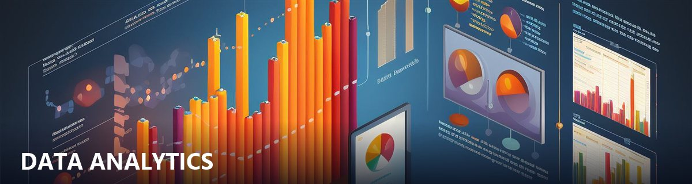

  

# AKASH YADAV

**Data Analytics** · AI-Assisted Workflows · Automation

Building a connected ecosystem of real, working data projects — not just a list of links.

 

📊 PROFILE AT A GLANCE
 

&nbsp;•&nbsp;

&nbsp;•&nbsp;

  

&nbsp;

&nbsp;

  

⭐ **4 Live Projects** &nbsp;·&nbsp; 📊 **2 Interactive Dashboards** &nbsp;·&nbsp; 📚 **1 Full Guidebook** &nbsp;·&nbsp; 🤖 **AI-Assisted Workflows**

 

↓ Explore the Ecosystem ↓

  

## 👨‍💻 About Me

### 👨‍💻 Meet the Creator

Hi, I'm **Akash Yadav**, based in **India 🇮🇳** and currently building toward a career as a Data Analyst, one real project at a time.

I like the moment a messy, unstructured dataset turns into something someone can actually act on — a dashboard, a clear number, a decision made a little more confidently. That's the part of the work I keep coming back to.

Akxyverse exists because my learning used to live scattered across notes, bookmarks, and half-finished folders. I built this ecosystem so everything — the projects, the fundamentals, the guidebooks, the proof of work — has one structured, public home instead of disappearing into private files.

### 🪐 Welcome to Akxyverse

Akxyverse is my ecosystem for Data Analytics, AI, Automation, real projects, guidebooks, and learning in public. It isn't a single portfolio — it's a connected set of repositories covering everything from raw data to shipped dashboards, from fundamentals to AI-assisted workflows. Explore whichever part is relevant to you, or follow the whole journey.

### 🎯 Mission

Turn raw data into decisions people can actually act on. Build analytics products that get used, not just tutorials that get forgotten. Learn in public, and document the process as honestly as the outcome.

### 🌌 Ecosystem Overview

- 📊 **[Data Analytics Projects](https://github.com/akxyverse/data-analytics-projects)** — hands-on, end-to-end analytics work, organized by tool and by domain
- 🧠 **[Knowledge Hub](https://github.com/akxyverse/data-analytics-knowledge-system)** — the core learning track: fundamentals, Python, SQL, BI tools
- 🤖 **[AI Automation](https://github.com/akxyverse/ai-automation)** — generative and agentic AI, LangChain, n8n
- 📚 **[Learning Resources](https://github.com/akxyverse/data-analytics-resources)** — books, guidebooks, courses, cheat sheets
- 💼 **[Career Hub](https://github.com/akxyverse/career-hub)** — resume, interview prep, applications
- 🏅 **[Certifications](https://github.com/akxyverse/certifications)** — verified credentials, in progress and earned
- ✍️ **[Content Studio](https://github.com/akxyverse/content-studio)** — articles, tutorials, and content assets
- 📦 **[Datasets](https://github.com/akxyverse/datasets)** — the data behind every project, organized by source

### 💭 Philosophy

Build in public, not behind closed doors.
Ship real projects, not just tutorials.
Document the process, not just the outcome.
Every version should be better than the last.

### 🚀 Currently Exploring

Machine Learning · Advanced SQL · DAX

 

> *A universe built one dataset, one dashboard, and one shipped project at a time.*

 

<table>
<tr>
<td width="25%" align="center" valign="top">

**🧭 Who**

Akash Yadav — Aspiring Data Analyst from India, learning and building in public.

</td>
<td width="25%" align="center" valign="top">

**💡 Why This Page**

The single starting point for everything I build — one hub, eight focused repositories.

</td>
<td width="25%" align="center" valign="top">

**👥 For**

Recruiters, hiring managers, fellow learners, and anyone exploring Data Analytics.

</td>
<td width="25%" align="center" valign="top">

**🎁 Value**

A live, growing map of real skills — not a static resume.

</td>
</tr>
</table>

### 🧭 Explore the Ecosystem

<table>
<tr>
<td align="center" width="11%"><a href="https://github.com/akxyverse/data-analytics-knowledge-system"><b>🧠</b> Knowledge Hub</a></td>
<td align="center" width="11%"><a href="https://github.com/akxyverse/data-analytics-projects"><b>🚀</b> Projects</a></td>
<td align="center" width="11%"><a href="https://github.com/akxyverse/datasets"><b>📦</b> Datasets</a></td>
<td align="center" width="11%"><a href="https://github.com/akxyverse/data-analytics-resources"><b>📚</b> Resources</a></td>
<td align="center" width="11%"><a href="https://github.com/akxyverse/career-hub"><b>💼</b> Career</a></td>
<td align="center" width="11%"><a href="https://github.com/akxyverse/content-studio"><b>✍️</b> Content</a></td>
<td align="center" width="11%"><a href="https://github.com/akxyverse/certifications"><b>🏅</b> Certs</a></td>
<td align="center" width="11%"><a href="https://github.com/akxyverse/ai-automation"><b>🤖</b> AI Automation</a></td>
</tr>
</table>

---

## 🗺 Choose Your Path

*First time here? Pick what you're looking for.*

<table>
<tr>
<td width="25%" align="center" valign="top">

### 🎓 Student
*Learning data analytics from scratch*

[Knowledge Hub](https://github.com/akxyverse/data-analytics-knowledge-system) → [Learning Resources](https://github.com/akxyverse/data-analytics-resources) → [Projects](https://github.com/akxyverse/data-analytics-projects)

</td>
<td width="25%" align="center" valign="top">

### 💼 Recruiter
*Evaluating my work*

[Featured Project Universe](#-featured-project-universe) → [Certifications](https://github.com/akxyverse/certifications) → [Career Hub](https://github.com/akxyverse/career-hub)

</td>
<td width="25%" align="center" valign="top">

### 📊 Fellow Analyst
*Looking for projects, tools, techniques*

[Projects](https://github.com/akxyverse/data-analytics-projects) → [Datasets](https://github.com/akxyverse/datasets) → [Knowledge Hub](https://github.com/akxyverse/data-analytics-knowledge-system)

</td>
<td width="25%" align="center" valign="top">

### 🤖 AI Enthusiast
*Interested in automation*

[AI Automation](https://github.com/akxyverse/ai-automation) → [Projects](https://github.com/akxyverse/data-analytics-projects)

</td>
</tr>
</table>

---

## ⚔️ Tech Arsenal

**🐍 Languages**
 

  

**🗄️ Databases**
 

  

**📦 Python Ecosystem**
 

  

**📊 Analytics & BI**
 

  

**🤖 AI & Automation**
 

  

**⚙️ Development Tools**
 

Icons render wherever the underlying icon library (simple-icons) actually carries that logo — a few tools shown above (Power BI, Tableau, Excel, VS Code, ChatGPT, Julius AI, Formula Bot, Quadratic AI) have no icon in that library at all (confirmed against its own source list, not a rendering bug), so those display as clean text-only tiles instead.

## 🚀 Featured Project Universe

Real, working analytics products, not a static list — new ones ship regularly, so this points straight to the live source instead of going stale.

**🚀 [Browse All Projects →](https://github.com/akxyverse/data-analytics-projects)**

## 🌌 Ecosystem Map

Akxyverse isn't one repository — it's several, each with a single job, designed to work together rather than duplicate each other.

 

**🧠 Learn**
 
**[Knowledge Hub](https://github.com/akxyverse/data-analytics-knowledge-system)** — the starting point: fundamentals before tools.
 
**[Learning Resources](https://github.com/akxyverse/data-analytics-resources)** — the reference shelf everything else draws from.

  

**🚀 Build**
 
**[Data Analytics Projects](https://github.com/akxyverse/data-analytics-projects)** — where fundamentals become real, shipped work.
 
**[Datasets](https://github.com/akxyverse/datasets)** — the raw material every project is built on.

  

**🤖 Automate**
 
**[AI Automation](https://github.com/akxyverse/ai-automation)** — where analytics work extends into AI and agentic workflows.

  

**💼 Career**
 
**[Career Hub](https://github.com/akxyverse/career-hub)** — where the work turns into opportunities.

  

**📚 Share**
 
**[Content Studio](https://github.com/akxyverse/content-studio)** — where the process gets written up and shared.
 
**[Certifications](https://github.com/akxyverse/certifications)** — where the learning gets externally verified.

## 📈 Live Activity

Live insight into the Akxyverse ecosystem — development activity, languages, and contribution patterns, pulled straight from GitHub.

  

### 📊 Account Overview
 

  

  

### 💻 Languages by Repo & by Commit
 

  

### ⏰ Productive Hours (IST)
 

  

### 🌱 Contribution Graph (Past Year)
 

  

### 🐍 Contribution Snake
 
<picture>
  <source media="(prefers-color-scheme: dark)" srcset="https://raw.githubusercontent.com/akxyverse/akxyverse/output/github-contribution-grid-snake-dark.gif">
  <source media="(prefers-color-scheme: light)" srcset="https://raw.githubusercontent.com/akxyverse/akxyverse/output/github-contribution-grid-snake.gif">
  
</picture>

## 🌍 Connect with Akash Yadav

Always up for a conversation about data, dashboards, or what to build next.

  

  

**⭐ If any of this ecosystem is useful to you, a star goes a long way.**

Akash Yadav — learning in public, one repository at a time.

  

